# HRCore Security Report — Part 4: The Proof

## Overview
This document records before/after evidence for each of the 7 intentional vulnerabilities: exploit success on `vulnerable-version` and failure on `secure-version`.

---

## 1. SQL Injection (A03 Injection)

**Where:** `GET /api/employees/search?name=`

**PoC (vulnerable):** Script that dumps all salaries via search endpoint.

**Before (vulnerable):** [Screenshot/recording — exploit succeeds]
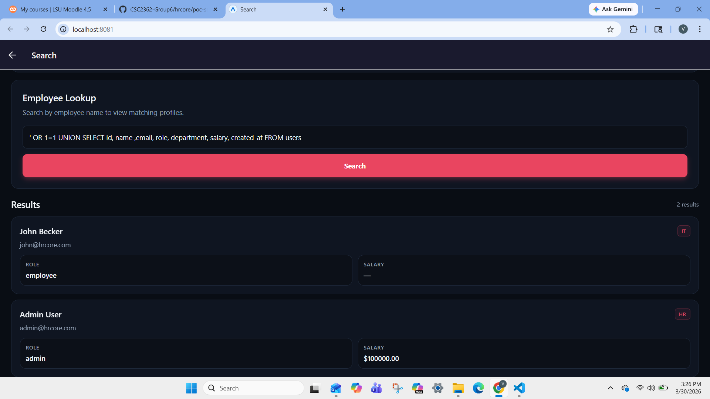

**After (secure):** [Screenshot/recording — same payload returns safe results / error]

---

## 2. Broken Access Control (A01)

**Where:** `/api/admin/*` — no role middleware.

**PoC (vulnerable):** `curl` hitting `/api/admin/all-employees` with a regular user token.

**Before (vulnerable):** [Screenshot — 200 OK, full employee list returned]
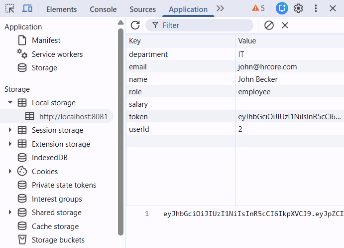
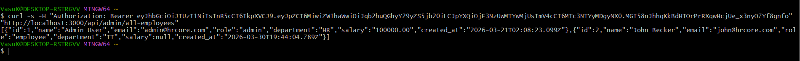

**After (secure):** [Screenshot — 403 Forbidden]

---

## 3. Stored XSS (A03 Injection)

**Where:** Leave request `notes` field rendered unsanitized (e.g. in `leave-view.html` or admin view).

**PoC (vulnerable):** Payload in notes: `` or token-stealing payload.

**Before (vulnerable):** [Screenshot — alert fires or token exfiltrated]

**After (secure):** [Screenshot — notes escaped/sanitized, no script execution]

---

## 4. Insecure Password Storage (A02)

**Where:** Plaintext or MD5 passwords in DB.

**PoC (vulnerable):** Screenshot of DB showing plaintext or weak hash.

**Before (vulnerable):** [Screenshot of `users.password` column]
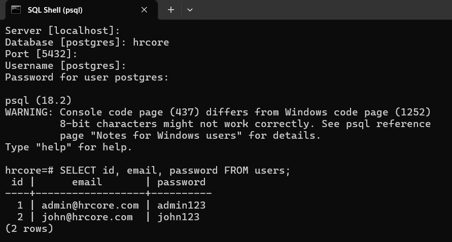

**After (secure):** [Screenshot — bcrypt hashes only]

---

## 5. Hardcoded JWT Secret (A02)

**Where:** `JWT_SECRET = "password123"` in source.

**PoC (vulnerable):** Forge a token with the known secret to become admin.

**Before (vulnerable):** [Screenshot — forged token accepted, admin access]
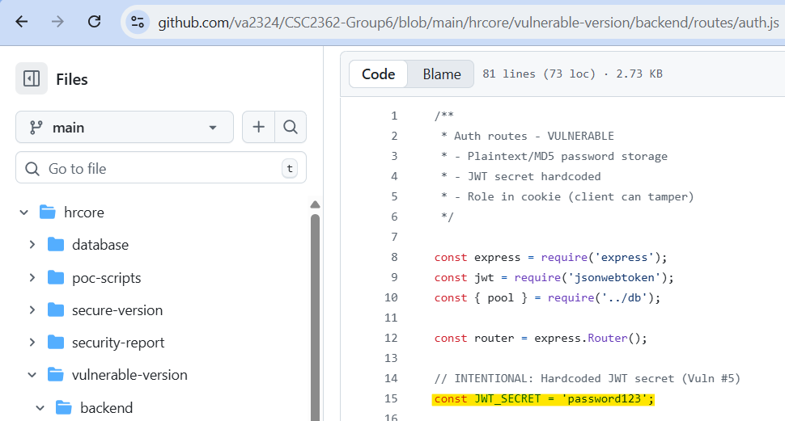
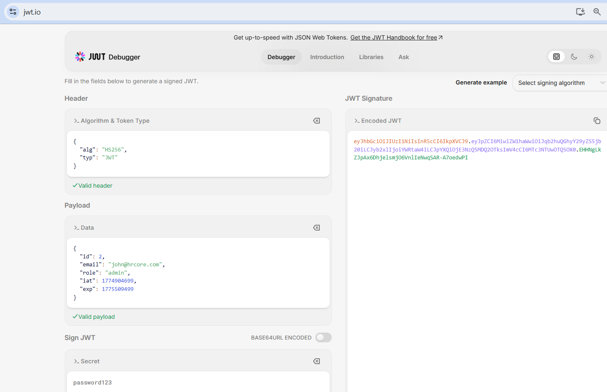
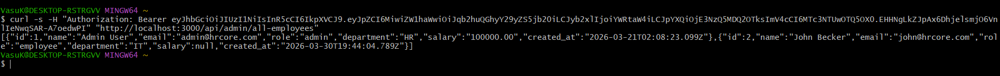

**After (secure):** [Screenshot — secret from env, forged token rejected]
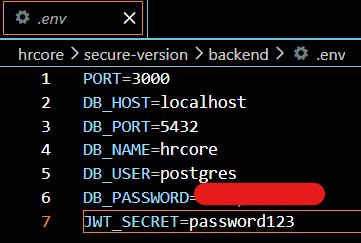
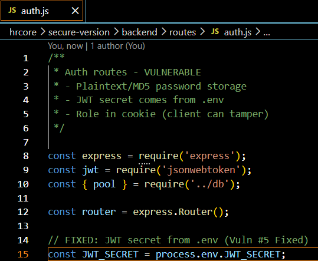
---

## 6. IDOR (A01)

**Where:** `GET /api/employees/:id` — any user can fetch any ID.

**PoC (vulnerable):** Script that iterates `/api/employees/1` … `/api/employees/100`.

**Before (vulnerable):** [Screenshot — all profiles returned]
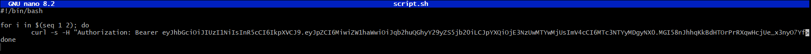
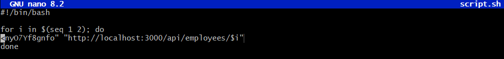
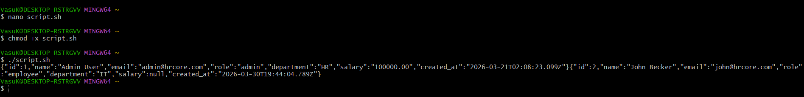

**After (secure):** [Screenshot — 403 for IDs other than own / admin]

---

## 7. Client-Side Role Escalation (A01)

**Where:** Role stored in AsyncStorage/cookie; user can edit to `admin`.

**PoC (vulnerable):** Modify AsyncStorage `role` to `admin`, reload, access admin screen.

**Before (vulnerable):** [Screenshot — admin panel visible and functional]
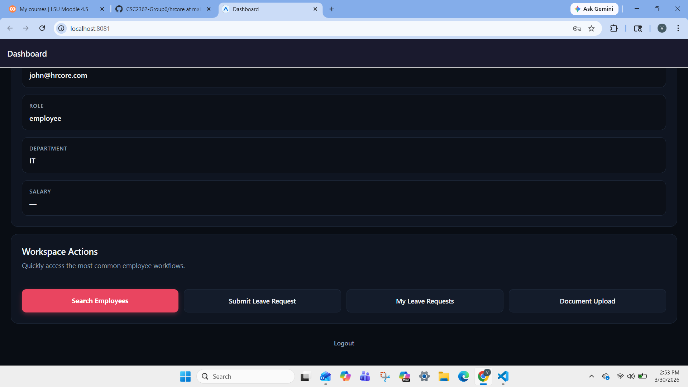
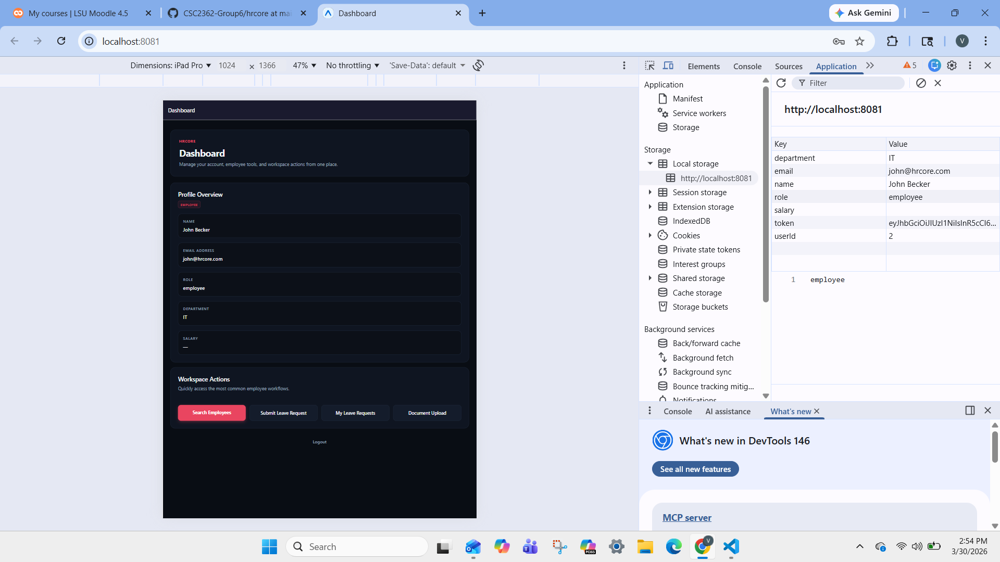
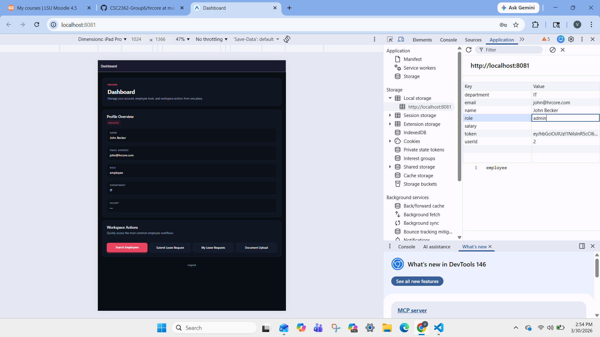
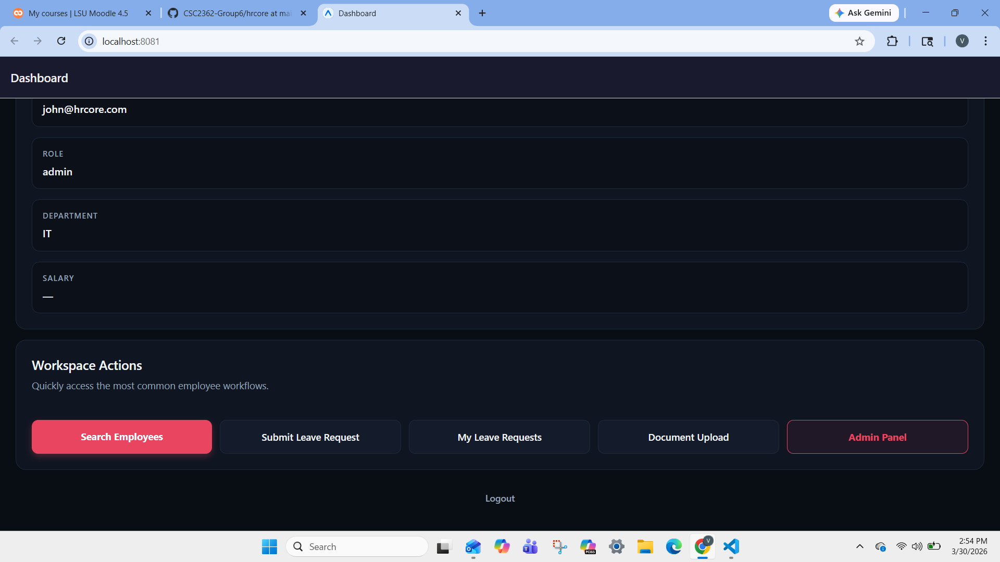

**After (secure):** [Screenshot — role from JWT only; editing storage has no effect, 403 on admin API]

---

## Regression Testing (secure version)

| Test | Result |
|------|--------|
| Login works for real users | ☐ |
| Employee can view own profile | ☐ |
| Admin can access admin panel via legitimate login | ☐ |
| Leave submission still works | ☐ |
| Search returns correct results (safely) | ☐ |

---

*Fill in screenshots/recordings and check regression boxes when completing Part 4.*
